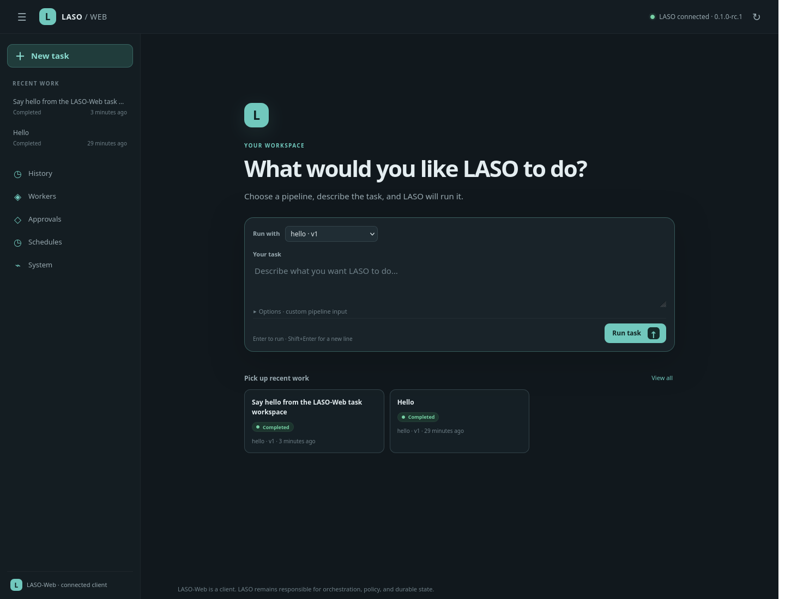
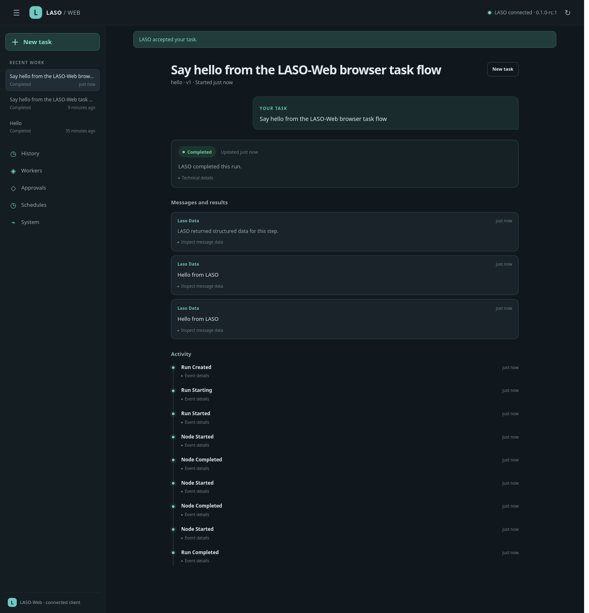
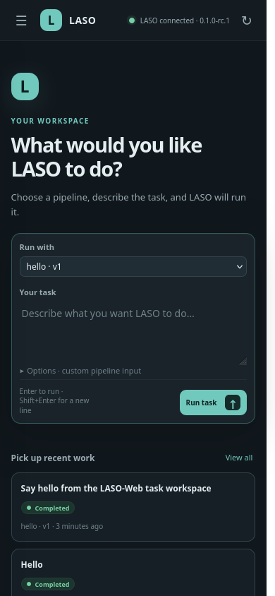

# LASO-Web

LASO-Web is a small, optional browser operator interface for [LASO](https://github.com/Registered-Agent-Attorney/LASO). It is a separate application and repository: LASO remains the orchestration/runtime core; this project presents a browser UI over LASO's existing JSON HTTP API.

The architecture is intentionally simple:

```text
Browser → LASO-Web (static UI + bounded same-origin API adapter) → LASO HTTP API
```

The adapter keeps LASO credentials out of browser JavaScript and avoids needing permissive CORS support in LASO. The application uses Python's standard library only; there is no npm build or runtime database.

The screenshots show a safe deterministic Hello-pipeline run:







## Workspace experience and API coverage

LASO-Web opens on a task workspace rather than a metrics dashboard. Choose a registered pipeline, describe the task, and follow that run from its returned state, event history, and messages. Recent runs are shown by task/pipeline label; identifiers and full API objects remain available in expandable technical details. The layout works as a collapsible desktop sidebar and a mobile navigation drawer.

Based on LASO's published `/api/v1` interface (see its [API reference](https://github.com/Registered-Agent-Attorney/LASO/blob/main/docs/access.md)), the UI currently provides:

* recurring health/version and list polling, plus run-specific `/events` and `/messages` polling;
* a task-first composer for an explicitly selected registered pipeline, with prompt input and an advanced custom JSON object option;
* recent work navigation, a worker-job history, and run workspaces with real LASO state, event history, returned messages/results, errors, and cancellation where supported;
* worker inventory and capabilities from `/workers`;
* contextual pending approvals/worker requests on their associated run, plus a full decision queue;
* read-only schedule listing and a secondary system-status view.

LASO assigns workers through pipeline definitions; it does not expose a separate operator API for changing worker assignments, so this UI does not invent one. Schedule listing is supported, but schedule editing is not included in this first release. Artifact listing/browsing, live event streams, worker-specific health probes, and configuration editing are also omitted because the current HTTP interface does not provide those GUI operations. LASO exposes no CORS headers; same-origin proxying is used instead.

## Requirements and quick start

Requirements: Python 3.10 or newer and a reachable LASO HTTP API. LASO-Web has no third-party Python dependencies.

```sh
git clone https://github.com/whiskywater/LASO-Web.git
cd LASO-Web
cp .env.example .env
./run.sh
```

The example config connects to LASO at `http://127.0.0.1:8080` and serves the UI at `http://127.0.0.1:8081`. Change `.env` to point at the LASO API. The small `.env` reader handles only `KEY=value` assignments and comments; it does not execute shell syntax or expand variables. Existing process environment variables override `.env` values.

Alternatively, configure explicitly without a file:

```sh
LASO_URL=http://127.0.0.1:8080 LASO_WEB_BIND=127.0.0.1 LASO_WEB_PORT=8081 ./run.sh
```

Configuration:

| Variable | Default | Purpose |
| --- | --- | --- |
| `LASO_URL` | `http://127.0.0.1:8080` | Operator-configured LASO API base URL; HTTP or HTTPS, no credentials/query/fragment. |
| `LASO_WEB_BIND` | `127.0.0.1` | Web listener address. Non-loopback binding requires a password. |
| `LASO_WEB_PORT` | `8081` | Web listener port. |
| `LASO_WEB_PASSWORD` | empty | Optional HTTP Basic password (username `operator`); required for non-loopback binding and at least 16 characters. |
| `LASO_WEB_ALLOWED_HOSTS` | loopback aliases on the configured port | Comma-separated accepted `Host` values; required with non-loopback binding to prevent unexpected host/DNS-rebinding access. |
| `LASO_TOKEN` | empty | Optional bearer credential sent only server-to-server to LASO. |

The LASO URL is deployment configuration, not browser input. The server forwards requests only to a strict allowlist of LASO API routes. Its startup config and authentication credentials are never returned to the browser.

## Connecting and using the UI

Open LASO-Web and choose one of the registered pipelines. Describe the task in ordinary text; by default it is sent as the pipeline input field `prompt`. Pipelines may expect another input shape, so **Options · custom pipeline input** lets you enter the JSON object required by that pipeline. LASO-Web does not choose a pipeline automatically because LASO does not expose automatic pipeline selection.

After LASO accepts a run, its workspace refreshes automatically every five seconds and shows only states, events, messages, and data returned by LASO. There is no fabricated progress percentage or generated worker narration. If the pipeline requires another input schema, inspect its definition in LASO and use the advanced input option. The **Approvals** view submits decisions to LASO's durable approval/request endpoints; when a pending record has a matching run ID, it is also shown in that run. LASO remains authoritative for policy.

**Workers**, **Approvals**, **Schedules**, and **System** remain available from the secondary navigation. LASO-Web only exposes API operations that LASO actually supports; worker assignment, pipeline authoring, schedule editing, and artifact browsing are not invented in the UI.

LASO's current local-development identity is unauthenticated. Therefore LASO-Web should be treated as an administrative console, not an internet-facing application. Keep both services on loopback/private network by default. For remote access, use a TLS reverse proxy, set a strong `LASO_WEB_PASSWORD`, and configure LASO's own supported identity/authorization before exposing sensitive operations. Do not bind LASO's unauthenticated development API publicly.

## Linux production installation

The service account needs read access to the application and its environment file; it does not need write access to the application tree. Example installation (review paths and account policy for the target machine):

```sh
sudo groupadd --system laso-web
sudo useradd --system --gid laso-web --home-dir /nonexistent --shell /usr/sbin/nologin laso-web
sudo install -d -o root -g root -m 0755 /opt/laso-web
sudo install -d -o root -g root -m 0750 /etc/laso-web
sudo install -m 0644 server.py run.sh /opt/laso-web/
sudo install -m 0644 -D static/index.html /opt/laso-web/static/index.html
sudo install -m 0644 -D static/app.js /opt/laso-web/static/app.js
sudo install -m 0644 -D static/model.js /opt/laso-web/static/model.js
sudo install -m 0644 -D static/style.css /opt/laso-web/static/style.css
sudo install -m 0644 deploy/systemd/laso-web.service /etc/systemd/system/laso-web.service
```

Create `/etc/laso-web/laso-web.env` with deployment-specific values, for example `LASO_URL=http://127.0.0.1:8080` and `LASO_WEB_BIND=127.0.0.1`. Restrict the file (`root:laso-web`, mode `0640`). Put optional credentials there rather than in the repository. Then:

```sh
sudo systemctl daemon-reload
sudo systemctl enable --now laso-web
systemctl status laso-web
journalctl -u laso-web
```

Upgrade by installing the new tracked application files into `/opt/laso-web`, then run `sudo systemctl restart laso-web`. No LASO-Web database or migration is involved.

The example unit runs as the unprivileged `laso-web` account, restarts on failure, has no writable application directory, and enables standard systemd filesystem/kernel/process hardening. Check local Python distribution paths before using a custom Python installation.

## Optional reverse proxies

Example snippets are in `deploy/nginx/` and `deploy/caddy/`. Configure valid TLS certificates and authentication/rate limiting appropriate to the deployment. Caddy can manage certificates for a real public domain automatically; the checked-in example domain is intentionally reserved and non-routable. Keep the app listener loopback-only behind the proxy. Set `LASO_WEB_ALLOWED_HOSTS` to the public host forwarded by the proxy. The app checks both the request `Host` and browser `Origin` on state-changing requests.

## Errors and limits

Upstream requests time out after 8 seconds. Browser requests have a 10-second deadline. Request bodies are capped at 1 MiB; LASO responses are capped at 4 MiB. Unreachable, slow, non-JSON, or oversized LASO responses become bounded error messages, while individual dashboard panels can fail independently. Access logging is disabled by default to avoid persisting client addresses or request paths; credentials, request bodies, and configured URLs are not logged.

## Development and tests

Node.js 22 is used only to run the dependency-free UI model tests; it is not required to run or deploy LASO-Web.

```sh
python3 -m unittest discover -s tests -v
node --test tests/test_ui_model.cjs
node --check static/model.js
node --check static/app.js
```

An optional real-server smoke test uses a temporary SQLite directory, registers the deterministic Hello pipeline, and creates/polls one run through LASO-Web's HTTP adapter:

```sh
python3 tests/integration_laso.py --server /path/to/laso-server --pipeline /path/to/LASO/examples/hello-pipeline/pipeline.yaml
```

The test stops its temporary LASO server and removes its isolated data directory. Do not pass a private project or production database to this command.

## Known limitations

This is an operator UI, not an identity provider, general API gateway, or full LASO client SDK. LASO's unauthenticated local identity means remote deployment requires explicit network controls and authentication at the web layer; the bundled Basic auth is intended to be used only over TLS. The application does not provide streaming updates, pipeline authoring, schedule editing, direct worker selection, artifact browsing, or new server-side authorization policy.
