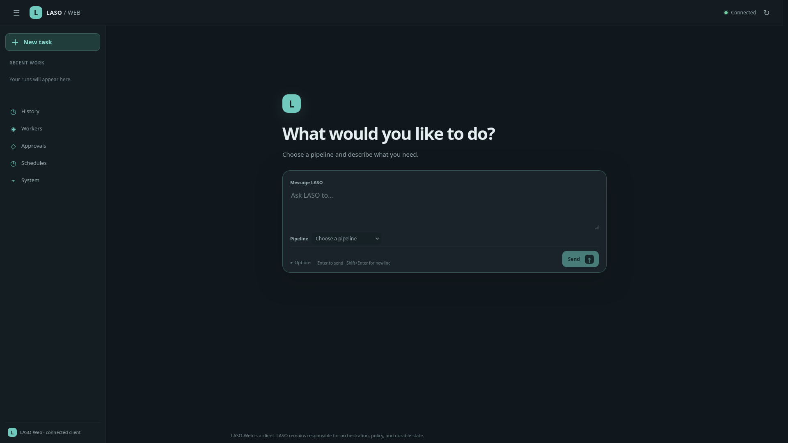
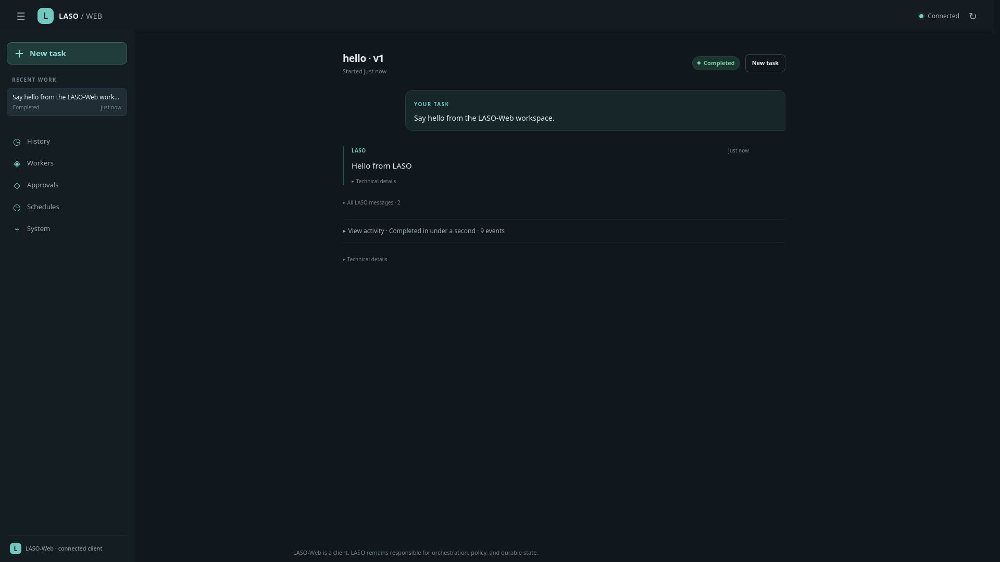
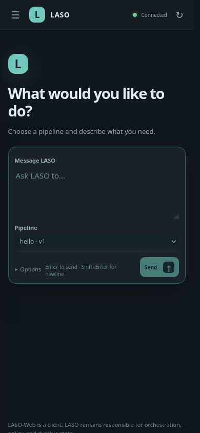

# LASO-Web

LASO-Web is a browser client for [LASO](https://github.com/Registered-Agent-Attorney/LASO). LASO remains the generic orchestration/runtime core. LASO-Web presents durable LASO sessions as conversations and retains the existing run/operator workspace for lower-level execution details.

The architecture is intentionally simple:

```text
Browser → LASO-Web (same-origin adapter) → LASO sessions, turns, runs and SSE
```

The Go server serves the complete application, including the run/operator workspace and durable-session chat. It keeps LASO credentials server-side, validates a strict API route allowlist, and proxies each client's SSE stream to LASO. It adds no conversation database, transcript cache, or process-local pub/sub. Python is not used by the production server or launcher.

The workspace and run-thread screenshots use a safe deterministic Hello-pipeline fixture:







## Workspace experience and API coverage

LASO-Web opens on a task workspace rather than a metrics dashboard. Choose a registered pipeline, describe the task, and follow that run as a thread: your submitted request, readable output LASO actually returned, and a compact state summary. Lifecycle activity, worker records, and raw API objects remain available in collapsed details. Recent runs are shown by task/pipeline label; a run link survives page refresh and browser back/forward navigation. The layout works as a collapsible desktop sidebar and a mobile navigation drawer.

Based on LASO's published `/api/v1` interface (see its [API reference](https://github.com/Registered-Agent-Attorney/LASO/blob/main/docs/access.md)), the UI currently provides:

* recurring health/version and list polling, plus run-specific `/events` and `/messages` polling;
* a task-first composer for an explicitly selected registered pipeline, with keyboard submission and an advanced custom JSON object option;
* recent work navigation, a worker-job history, and run workspaces with real LASO state, event history, returned messages/results, errors, and cancellation where supported;
* worker inventory and capabilities from `/workers`;
* contextual pending approvals/worker requests on their associated run, plus a full decision queue;
* read-only schedule listing and a secondary system-status view.

The complete application runs through the Go backend. See [the migration and API coverage notes](docs/go-backend.md) for the retained Python server behavior and its Go implementation.

LASO assigns workers through pipeline definitions; it does not expose a separate operator API for changing worker assignments, so this UI does not invent one. Schedule listing is supported, but schedule editing is not included in this release. Artifact listing/browsing, worker-specific health probes, and configuration editing are omitted because the current HTTP interface does not provide those GUI operations. Durable sessions use LASO's session SSE stream; the run/operator workspace continues to refresh its run-specific panels periodically. LASO exposes no CORS headers; same-origin proxying is used instead.

## Requirements and quick start

Requirements: Go 1.23 or newer and a reachable LASO HTTP API. Node.js 22 is only needed to run the browser model tests. The optional real-LASO integration harnesses use Python 3 but are not needed to build or operate the server.

```sh
git clone https://github.com/whiskywater/LASO-Web.git
cd LASO-Web
./run.sh
```

`run.sh` starts the Go server and reports a clear error if Go is missing. The server reads a simple `.env` file with `KEY=value` lines and comments; it does not execute shell syntax or expand variables. Process environment values take precedence. The default connects to LASO at `http://127.0.0.1:8080` and serves `http://127.0.0.1:8081`.

Build a standalone Go binary with `go build -trimpath -o laso-web .`.

Configure explicitly without a file:

```sh
LASO_URL=http://127.0.0.1:8080 LASO_WEB_BIND=127.0.0.1 LASO_WEB_PORT=8081 ./run.sh
```

Configuration:

| Variable | Default | Purpose |
| --- | --- | --- |
| `LASO_URL` | `http://127.0.0.1:8080` | Operator-configured LASO API base URL; HTTP or HTTPS, no credentials/query/fragment. |
| `LASO_WEB_BIND` | `127.0.0.1` | Web listener address. Non-loopback binding requires a password. |
| `LASO_WEB_PORT` | `8081` | Web listener port. |
| `LASO_WEB_PASSWORD` | empty | Optional HTTP Basic password (username `operator`); required for non-loopback binding and at least 16 characters. |
| `LASO_WEB_ALLOWED_HOSTS` | loopback aliases on the configured port | Comma-separated accepted `Host` values; required with non-loopback binding to prevent unexpected host/DNS-rebinding access. |
| `LASO_TOKEN` | empty | Optional bearer credential sent only server-to-server to LASO. |

The LASO URL is deployment configuration, not browser input. The server forwards requests only to a strict allowlist of LASO API routes. Its startup config and authentication credentials are never returned to the browser.

## Connecting and using the UI

Choose **New chat**, select a registered LASO pipeline, and create a session. The URL `/sessions/<session-id>` identifies the durable LASO session and can be bookmarked or opened from another LASO-Web client connected to the same LASO deployment. Messages are submitted as idempotent session turns using the selected pipeline's `prompt` input. LASO runs sequentially and returns durable turns linked to run IDs; the UI shows run details secondarily. A pipeline requiring a different input schema should be adapted before using the chat composer.

LASO's session API has no title or rename field yet. The sidebar derives a display label from the first turn, with a pipeline/date fallback. LASO-Web deliberately does not save titles or transcripts locally. The page restores the latest ordered turn page from `GET /sessions/{id}/turns` on each load; **Load earlier turns** retrieves prior pages from LASO on demand.

## Durable sessions and live updates

LASO session IDs identify generic runtime sessions, not LASO-Web users or application accounts. Session turns and events are stored by LASO; the browser does not write authoritative transcript state to localStorage, and LASO-Web does not create a second conversation store. A second client using the same session ID reads the same ordered turn history and opens its own SSE connection to LASO.

LASO-Web consumes `POST /api/v1/sessions`, `GET /api/v1/sessions`, `GET /api/v1/sessions/{id}`, `GET/POST /api/v1/sessions/{id}/turns`, and `GET /api/v1/sessions/{id}/events/stream`. LASO's SSE IDs are per-session monotonically increasing decimal sequence numbers; reconnects send `Last-Event-ID`, and replay may duplicate a delivery. The browser deduplicates by exact sequence cursor and refreshes the durable ordered turn list when events arrive. After a full page reload it safely replays from the beginning of the durable event journal. LASO currently streams lifecycle events, not generated text tokens; LASO-Web does not simulate token streaming. Temporary outages and LASO's `429 Retry-After` admission response cause reconnect with backoff.

Current public LASO `main` exposes no capability-discovery endpoint. The Go adapter checks session API support by calling the real session-list endpoint and handles older LASO responses with a compatibility message. The page also requires the real SSE route. No feature is advertised based on a version number. Context generation and automatic reduction PRs are not required for basic durable turns and were not assumed; future context/run provenance can be surfaced from LASO once it is available upstream.

LASO's current development identity is unauthenticated and does not enforce per-user session ownership. LASO-Web's optional Basic credential is a shared gateway password, not a user identity or membership policy. Anyone admitted to this web gateway who knows a session ID can access it. Keep LASO and LASO-Web private/loopback by default; remote access requires TLS, a strong web password, host allowlisting, and deployment-owned authorization around session IDs. The LASO bearer token remains only in Go server configuration. LASO-Web does not add accounts, session membership, or product authorization.

After LASO accepts a standalone run, its workspace refreshes automatically every five seconds without repeatedly replacing unchanged content. Activity and technical details start collapsed, and remain available while keeping the returned result in focus. There is no fabricated progress percentage or generated worker narration. Enter submits the task; Shift+Enter inserts a newline. If the pipeline requires another input schema, inspect its definition in LASO and use the advanced input option. The **Approvals** view submits decisions to LASO's durable approval/request endpoints; when a pending record has a matching run ID, it is also shown in that run. LASO remains authoritative for policy.

**Workers**, **Approvals**, **Schedules**, and **System** remain available from the secondary navigation. LASO-Web only exposes API operations that LASO actually supports; worker assignment, pipeline authoring, schedule editing, and artifact browsing are not invented in the UI.

LASO's current local-development identity is unauthenticated. Treat LASO-Web as a trusted-network client, not an internet-facing application. Keep both services on loopback/private network by default. For remote access, use a TLS reverse proxy, set a strong `LASO_WEB_PASSWORD`, and configure deployment-owned authorization before exposing session IDs or operational endpoints. Do not bind LASO's unauthenticated development API publicly.

## Linux production installation

Build and install the Go binary and the `laso-web.service` unit. The service account needs read access to the binary and environment file; it does not need write access to the application tree:

```sh
sudo groupadd --system laso-web
sudo useradd --system --gid laso-web --home-dir /nonexistent --shell /usr/sbin/nologin laso-web
go build -trimpath -o laso-web .
sudo install -d -o root -g root -m 0755 /opt/laso-web
sudo install -m 0755 laso-web /opt/laso-web/laso-web
sudo install -m 0644 deploy/systemd/laso-web.service /etc/systemd/system/laso-web.service
```

Create `/etc/laso-web/laso-web.env` with `LASO_URL`, `LASO_WEB_BIND`, optional
`LASO_WEB_PASSWORD`, `LASO_WEB_ALLOWED_HOSTS`, and `LASO_TOKEN`. Restrict the
file (`root:laso-web`, mode `0640`). Enable the service with the systemd commands
below. Keep the Go binary and LASO API loopback/private unless TLS and
deployment-owned authorization protect remote use.

Create `/etc/laso-web/laso-web.env` with deployment-specific values, for example `LASO_URL=http://127.0.0.1:8080` and `LASO_WEB_BIND=127.0.0.1`. Restrict the file (`root:laso-web`, mode `0640`). Put optional credentials there rather than in the repository. Then:

```sh
sudo systemctl daemon-reload
sudo systemctl enable --now laso-web
systemctl status laso-web
journalctl -u laso-web
```

Upgrade by installing the new tracked application files into `/opt/laso-web`, then run `sudo systemctl restart laso-web`. No LASO-Web database or migration is involved.

The example unit runs as the unprivileged `laso-web` account, restarts on failure, has no writable application directory, and enables standard systemd filesystem/kernel/process hardening.

## Optional reverse proxies

Example snippets are in `deploy/nginx/` and `deploy/caddy/`. Configure valid TLS certificates and authentication/rate limiting appropriate to the deployment. Caddy can manage certificates for a real public domain automatically; the checked-in example domain is intentionally reserved and non-routable. Keep the app listener loopback-only behind the proxy. Set `LASO_WEB_ALLOWED_HOSTS` to the public host forwarded by the proxy. The app checks both the request `Host` and browser `Origin` on state-changing requests.

## Errors and limits

Upstream requests time out after 8 seconds. Browser requests have a 10-second deadline. Request bodies are capped at 1 MiB; LASO responses are capped at 4 MiB. Unreachable, slow, non-JSON, or oversized LASO responses become bounded error messages, while individual dashboard panels can fail independently. Access logging is disabled by default to avoid persisting client addresses or request paths; credentials, request bodies, and configured URLs are not logged.

## Development and tests

Go 1.23+ builds and runs the complete application without third-party modules. Node.js 22 is used only for browser model tests. Python is used only by optional real-LASO integration harnesses.

```sh
gofmt -w main.go internal/web/*.go
go vet ./...
go test ./...
go test -race ./...
go build -trimpath -o laso-web .
node --test tests/test_ui_model.cjs
node --test tests/test_session_model.cjs
node --check static/model.js
node --check static/app.js
node --check static/sessions.js
node --check static/session.js
```

Optional real-server integration tests use an isolated PostgreSQL schema and exercise the Go binary against PostgreSQL-backed LASO. Set `LASO_TEST_POSTGRES_DSN` to a disposable test database connection string first:

```sh
python3 tests/integration_laso.py --server /path/to/laso-server --web /path/to/laso-web --pipeline /path/to/LASO/examples/hello-pipeline/pipeline.yaml --approval-pipeline /path/to/LASO/examples/human-approval/pipeline.yaml
python3 tests/integration_sessions.py --server /path/to/laso-server --web /path/to/laso-web --pipeline /path/to/LASO/examples/hello-pipeline/pipeline.yaml
```

The scripts start isolated LASO services, use separate per-process state directories, and drop their test schema on completion. The session test starts two PostgreSQL LASO processes and two Go frontends. They invoke only the Go LASO-Web binary; Python and `psql` are optional test-harness requirements, never production dependencies. Do not pass a private project or production database to these commands.

## Known limitations

This is an application client, not an identity provider or full LASO SDK. Session titles cannot be persisted or renamed with the current LASO API. Shared sessions have no per-user ACL until LASO/deployment identity and policy are configured. Session SSE reports execution events rather than token streaming. LASO-Web does not provide pipeline authoring, schedule editing, direct worker selection, artifact browsing, context reduction, or new LASO authorization policy.
